# Ragverse

Ragverse is an authenticated multimodal RAG workspace for uploading documents, audio files, and public web pages, choosing which sources are active, and asking source-cited questions over that selected knowledge.

Live demo:

- Frontend: [https://ragverse.vercel.app](https://ragverse.vercel.app)
- Backend health: [https://ragverse-api.onrender.com/health](https://ragverse-api.onrender.com/health)

> Demo note: this deployment uses Vercel, Render, and Supabase. Render runs as a stateless FastAPI host and may cold start on the free tier. Durable workspace state, source files, chat history, active document selections, and vector chunks are stored in Supabase instead of Render memory.

## Highlights

- Private workspace per authenticated user.
- PDF, DOCX, XLSX, CSV, PPTX, audio, and public URL ingestion.
- Active knowledge selection, so only chosen sources influence document answers.
- Multi-source retrieval with cited source cards.
- Persistent library, active documents, and chat history after refresh, logout, backend restart, or redeploy.
- Supabase Storage for original files and URL artifacts.
- Supabase Postgres with pgvector for production chunk retrieval.
- Streaming chat over server-sent events.
- Provider routing across hosted model providers with local fallback support where configured.
- Guardrails for corrupted files, fake extensions, unsupported formats, empty files, private URLs, invalid URLs, and failed web pages.
- Cascading cleanup for document deletion and user-owned workspace deletion.

## Demo Walkthrough

### 1. Sign Up

Users can create an account and get a private Ragverse workspace.

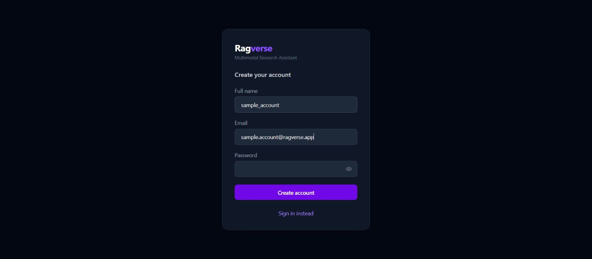

### 2. Workspace Library

After login, the sidebar shows the user's uploaded documents, audio files, spreadsheets, presentations, and URL sources.

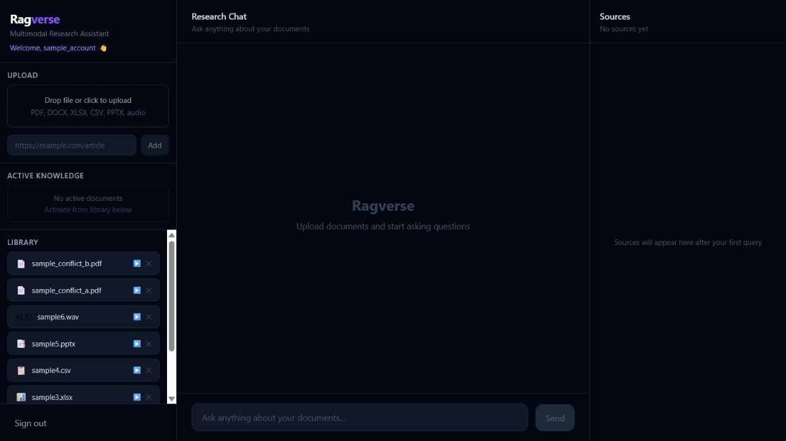

### 3. Activate A Source

A document must be activated before it is used as knowledge for document-specific questions.

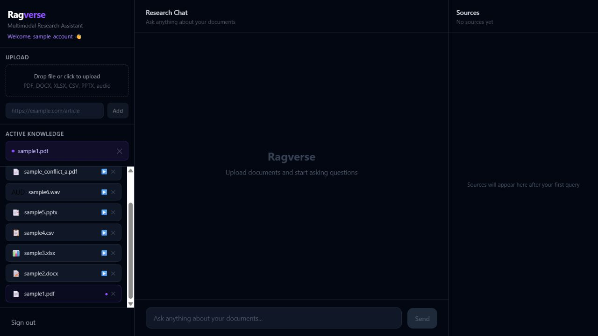

### 4. Ask With Sources

Ragverse retrieves relevant chunks from the active source and returns an answer with source citations.

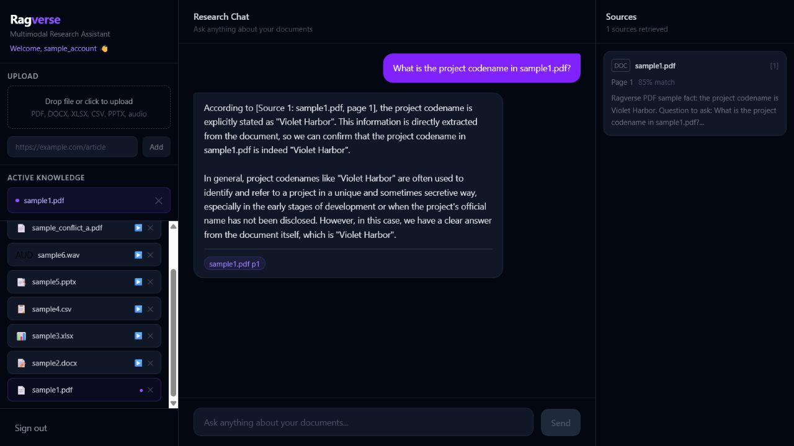

### 5. Supported File Types

The ingestion flow supports documents, spreadsheets, presentations, and audio transcripts. This proof shows a PPTX source answering with citations.

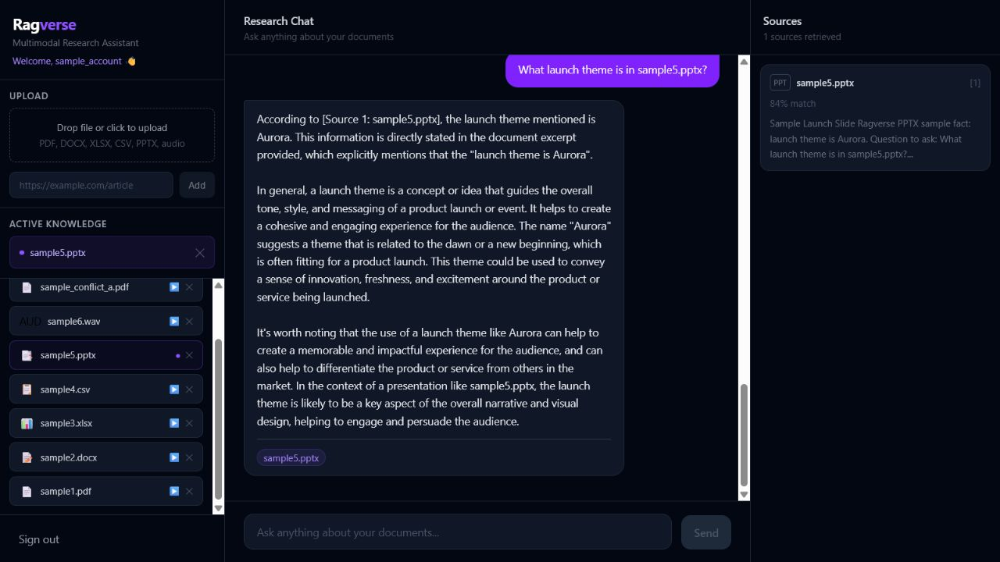

### 6. URL Knowledge

Public HTTP/HTTPS pages can be ingested as URL knowledge and cited in chat.

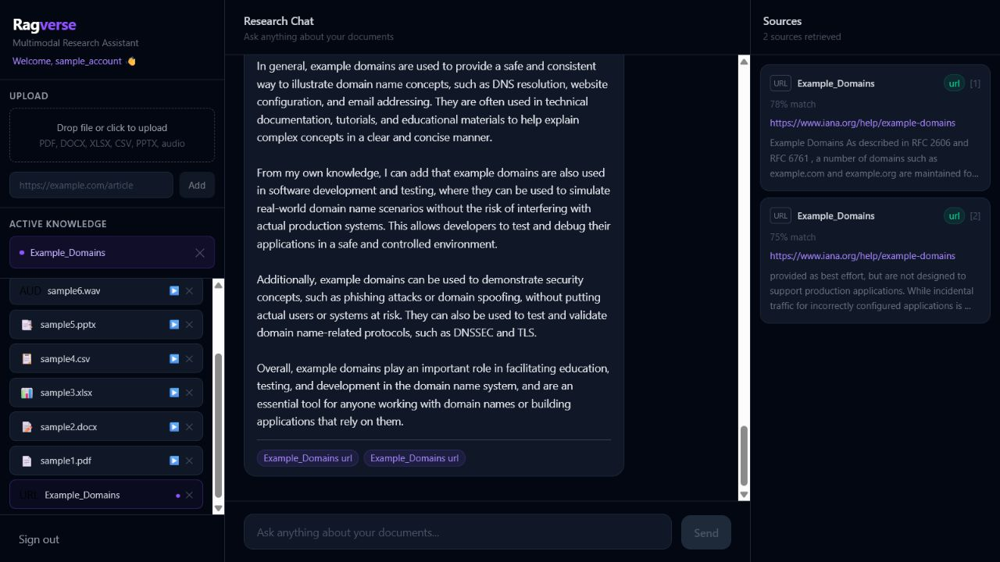

### 7. Multiple Active Sources

When multiple sources are active, Ragverse retrieves a balanced candidate set across selected documents and answers from the combined active knowledge.

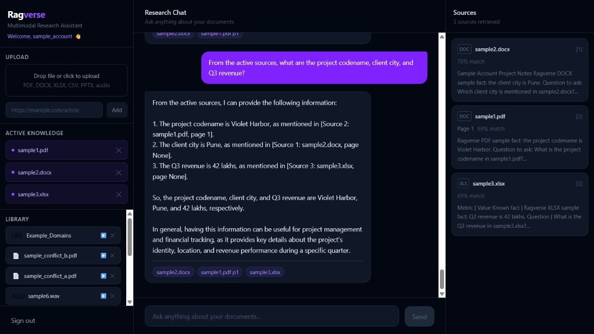

### 8. Persistent Workspace

Library items, active documents, and recent chat history restore after logout and login.

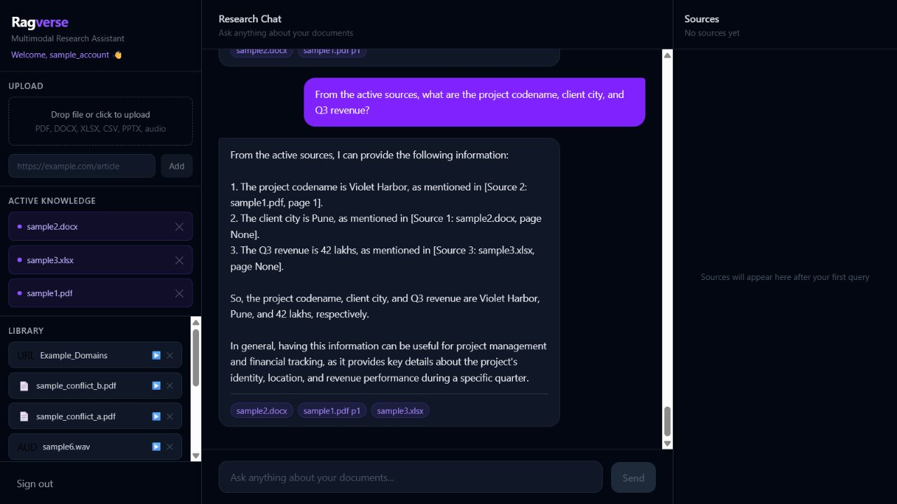

### 9. Clean Guardrails

Invalid or unsafe inputs fail with clear messages instead of crashing the app or creating partial library entries.

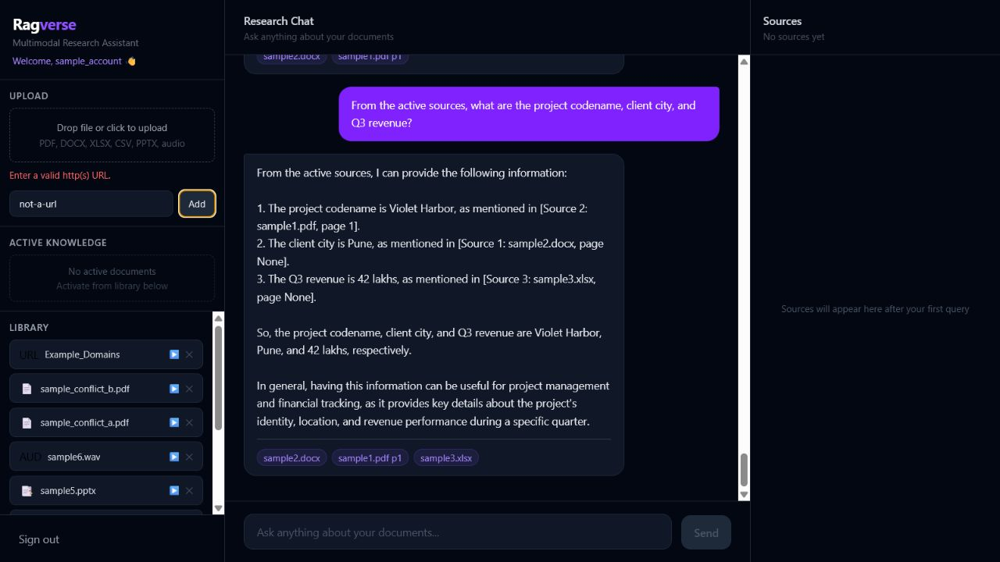

### 10. Deletion

Deleting a source removes it from the library and clears the associated retrieval context for that document.

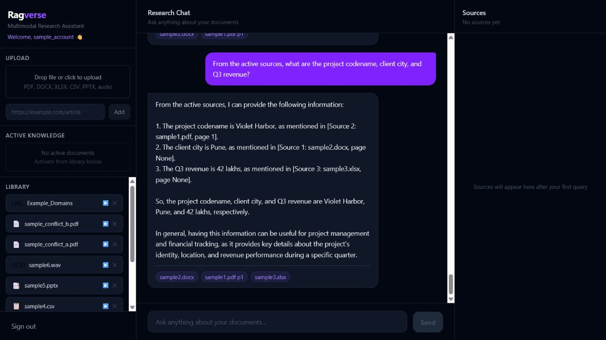

## User Guide

1. Open the live frontend.
2. Sign up with an email and password.
3. Upload a supported file or add a public URL.
4. Wait for ingestion to finish.
5. Activate one or more sources from the library.
6. Ask a question in the research chat.
7. Review the source cards before trusting a document-specific answer.
8. Deactivate sources when they should not influence the next answer.
9. Refresh or log out if needed; the workspace restores after login.
10. Delete test documents when they are no longer needed.

Example questions:

- `What is the project codename in sample1.pdf?`
- `What is the Q3 revenue in sample3.xlsx?`
- `Summarize the active sources together.`
- `What are example domains used for?`

## Validation Rules

- Supported document formats: `.pdf`, `.docx`, `.xlsx`, `.csv`, and `.pptx`.
- Supported audio/video transcript formats: `.mp3`, `.wav`, `.m4a`, `.ogg`, `.webm`, and `.mp4`.
- Supported URL inputs: public `http` and `https` pages with readable text content.
- Empty files are rejected before ingestion.
- Unsupported extensions are rejected before parsing.
- Corrupted files and content-extension mismatches are rejected with clean `400` responses.
- Private, local, reserved, and metadata-service URLs are blocked.
- 404 pages and unreadable pages fail without adding partial library entries.
- Filenames are sanitized before storage.
- Authenticated document reads, activation, retrieval, and deletion are scoped to the owning user.

## Tech Stack

Frontend:

- React
- Vite
- Tailwind CSS
- Server-sent event streaming client

Backend:

- FastAPI
- LangChain document loading and chunking
- JWT auth
- bcrypt password hashing
- File signature validation
- SSRF-aware URL validation

Persistence:

- Supabase Postgres
- Supabase Storage
- pgvector for production vector retrieval
- SQLite and local file storage for local development

Model and provider integrations:

- Groq
- Gemini
- Cohere
- Optional local Ollama fallback where configured

Deployment:

- Vercel static frontend
- Render FastAPI backend
- Supabase database, storage, and vector persistence

## Architecture

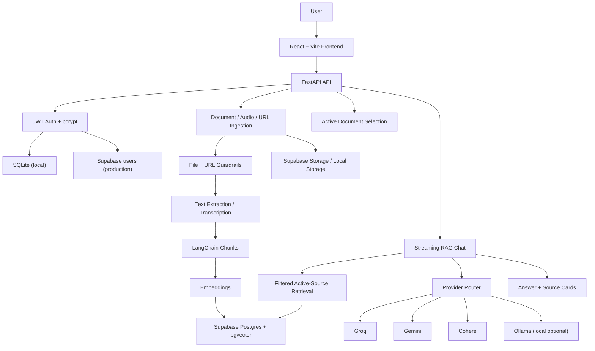

## Local Development

Local development does not require Supabase. In local mode, Ragverse uses local auth/database/storage settings so the app can be tested without production infrastructure.

### Backend

```powershell
cd backend
python -m venv denv
.\denv\Scripts\activate
pip install -r requirements.txt
copy .env.example .env
uvicorn main:app --host 127.0.0.1 --port 8000 --reload
```

Local backend profile:

```env
ENV=local
AUTH_PROVIDER=local
STORAGE_MODE=local
SQLITE_DB_PATH=./data/ragverse.db
JWT_SECRET_KEY=replace-with-local-secret
GROQ_API_KEY=
GEMINI_API_KEY=
COHERE_API_KEY=
```

### Frontend

```powershell
cd frontend
npm install
copy .env.example .env
npm run dev
```

Local frontend `.env`:

```env
VITE_API_URL=http://localhost:8000/api
```

## Environment Variables

Backend essentials:

```env
ENV=production
AUTH_PROVIDER=supabase
STORAGE_MODE=supabase
DATABASE_URL=postgresql://...
SUPABASE_URL=https://your-project.supabase.co
SUPABASE_KEY=replace-with-server-side-key
SUPABASE_BUCKET=ragverse
JWT_SECRET_KEY=replace-with-a-long-random-secret
BACKEND_CORS_ORIGINS=https://your-frontend-url
GROQ_API_KEY=
GEMINI_API_KEY=
COHERE_API_KEY=
RAG_CHAT_MODELS=groq:llama-3.3-70b-versatile,gemini:gemini-2.5-flash
TRANSCRIPTION_MODELS=groq:whisper-large-v3-turbo
EMBEDDING_MODELS=gemini:gemini-embedding-001,cohere:embed-english-light-v3.0
ENABLE_RERANKER=false
```

Frontend essentials:

```env
VITE_API_URL=https://your-backend-url/api
```

See `backend/.env.example` and `frontend/.env.example` for the full local configuration surface.

## Deployment

The production branch is used for the deployed Vercel and Render services.

Recommended flow:

1. Push the `production` branch.
2. Deploy the backend on Render as a FastAPI web service.
3. Set backend environment variables in Render.
4. Run `supabase_schema.sql` in the Supabase SQL Editor.
5. Confirm Supabase Storage has the configured bucket.
6. Verify backend health at `/health`.
7. Deploy the frontend on Vercel with the frontend root directory.
8. Set `VITE_API_URL` to the Render backend API URL.
9. Add the Vercel origin to `BACKEND_CORS_ORIGINS`.
10. Redeploy backend after CORS or provider-route changes.

## Tested Proof Points

- Live frontend opens through Vercel.
- Live backend health returns OK.
- Signup and login work for a disposable user.
- PDF, DOCX, XLSX, CSV, PPTX, audio, and URL ingestion succeed.
- Each supported source type can be activated and queried.
- Answers include source cards for active document knowledge.
- Multiple active documents work as combined knowledge.
- Inactive documents are excluded from retrieval context.
- With no active documents, general chat works without sources.
- With no active documents, document-specific questions ask the user to activate a source.
- Refresh restores library, active documents, and chat history.
- Logout/login restores the same workspace state.
- Invalid URL, private URL, and 404 URL cases fail cleanly.
- Corrupted files, empty files, unsupported files, and fake extensions fail cleanly.
- Document deletion removes the source from the library and retrieval context.
- User deletion is designed to cascade through user-owned documents, chunks, chat sessions, active selections, and stored artifacts.

## Known Demo Limitations

- Render free services may cold start, so the first request can be slower.
- Model/provider latency can vary during ingestion and chat.
- Audio transcription quality depends on input clarity and provider behavior.
- Very large files may exceed practical free-tier processing limits.
- The hosted demo is optimized for portfolio review and functional validation, not high-volume production traffic.

## Why This Project Matters

Ragverse demonstrates practical RAG engineering across ingestion, retrieval, persistence, and deployment. The project covers multimodal parsing, user-scoped source ownership, active-document retrieval, source-cited chat, durable Supabase-backed production storage, security validation, and the tradeoffs needed to run a useful AI workspace on free-tier infrastructure.
