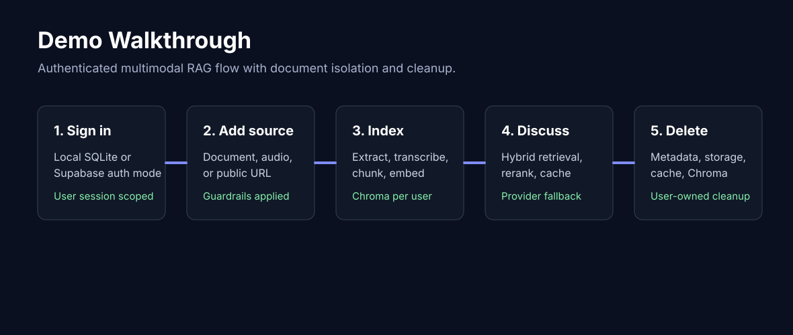
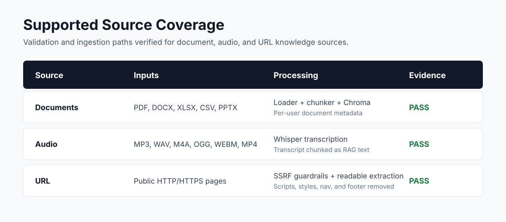
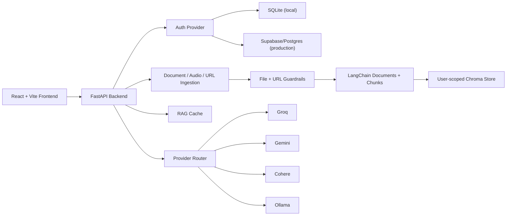
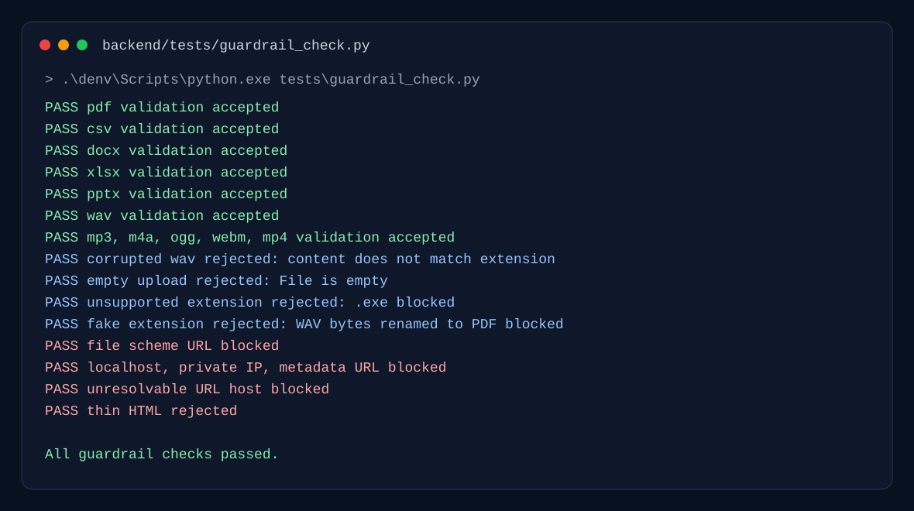

# Ragverse

Secure multimodal RAG workspace for discussing documents, audio clips, and public web pages.

Ragverse is a FastAPI + React/Vite application built around authenticated, user-scoped knowledge ingestion. It combines LangChain document processing, Chroma retrieval, FlashRank reranking, cache-aware responses, provider fallback, local SQLite development auth, and Supabase-ready production metadata.



## Highlights

| Area | Capability |
| --- | --- |
| Multimodal ingestion | PDF, DOCX, XLSX, CSV, PPTX, MP3, WAV, M4A, OGG, WEBM, MP4, and public HTTP/HTTPS URLs |
| Retrieval | Chunking, Chroma vector search, MMR retrieval, FlashRank reranking, and cache-aware chat flow |
| Provider routing | Env-driven fallback for Groq, Gemini, Cohere, and Ollama |
| Local mode | SQLite auth/database and local file storage for offline-friendly testing |
| Production mode | Supabase/Postgres metadata, Supabase Storage support, and Render deployment config |
| Security | File signature checks, fake-extension detection, SSRF URL blocking, size limits, filename sanitization, and clean parser failure handling |
| Ownership | Documents, artifacts, chunks, uploads, Chroma entries, and cache references are scoped by authenticated user |

## Demo Walkthrough

1. Create an account or sign in.
2. Upload a supported document, upload an audio clip, or submit a public URL.
3. Ragverse validates the source, extracts or transcribes knowledge, chunks it, embeds it, and stores user-owned metadata.
4. Ask questions over the active source.
5. Delete a source when it is no longer needed. Deletion removes metadata, storage artifacts, Chroma chunks, local files, and active cache references where applicable.

## Supported Inputs



| Source type | Accepted inputs | Processing path | Validation proof |
| --- | --- | --- | --- |
| Document | `.pdf` | PDF signature validation, loader, chunking, Chroma indexing | `PASS pdf validation accepted` |
| Document | `.docx` | Office Open XML validation, loader, chunking, Chroma indexing | `PASS docx validation accepted` |
| Document | `.xlsx` | Office Open XML validation, spreadsheet loader, chunking, Chroma indexing | `PASS xlsx validation accepted` |
| Document | `.csv` | UTF-8/text validation, CSV parsing, chunking, Chroma indexing | `PASS csv validation accepted` |
| Document | `.pptx` | Office Open XML validation, presentation loader, chunking, Chroma indexing | `PASS pptx validation accepted` |
| Audio | `.wav` | MIME/signature validation, Groq Whisper transcription, transcript chunking | `PASS wav validation accepted` |
| Audio | `.mp3` | MIME/signature validation, Groq Whisper transcription, transcript chunking | `PASS mp3 validation accepted` |
| Audio | `.m4a` | MIME/signature validation, Groq Whisper transcription, transcript chunking | `PASS m4a validation accepted` |
| Audio | `.ogg` | MIME/signature validation, Groq Whisper transcription, transcript chunking | `PASS ogg validation accepted` |
| Audio | `.webm` | MIME/signature validation, Groq Whisper transcription, transcript chunking | `PASS webm validation accepted` |
| Audio | `.mp4` | MIME/signature validation, Groq Whisper transcription, transcript chunking | `PASS mp4 validation accepted` |
| URL | Public `http` and `https` pages | SSRF validation, HTML/text fetch, readable extraction, chunking | URL guardrail checks passed |

## Architecture



## Provider Routing

Model routes are controlled through environment variables, so local and production deployments use different fallback profiles without code changes.

```env
RAG_CHAT_MODELS=groq:llama-3.3-70b-versatile,gemini:gemini-2.5-flash,ollama:llama3.2
VISION_MODELS=gemini:gemini-2.5-flash,ollama:qwen3-vl:2b
TRANSCRIPTION_MODELS=groq:whisper-large-v3-turbo
EMBEDDING_MODELS=gemini:gemini-embedding-001,cohere:embed-english-light-v3.0,ollama:nomic-embed-text
```

Provider profiles:

| Environment | Profile |
| --- | --- |
| Local | Hosted providers first, Ollama last fallback |
| Production | Hosted providers only unless the deployment includes an Ollama service |

## Local Setup

### Backend

```powershell
cd backend
python -m venv denv
.\denv\Scripts\activate
pip install -r requirements.txt
copy .env.example .env
uvicorn main:app --host 127.0.0.1 --port 8000 --reload
```

Local backend profile:

```env
ENV=local
AUTH_PROVIDER=local
STORAGE_MODE=local
SQLITE_DB_PATH=./data/ragverse.db
JWT_SECRET_KEY=<local-secret>
GROQ_API_KEY=<key>
GEMINI_API_KEY=<key>
COHERE_API_KEY=<key>
```

Local auth and metadata are stored in `backend/data/ragverse.db`. Supabase is not required for local testing.

### Frontend

```powershell
cd frontend
npm install
npm run dev
```

Frontend default:

```env
VITE_API_URL=http://localhost:8000/api
```

## Production Deployment

`render.yaml` defines the backend web service for Render. Production secrets stay in the Render dashboard, not in Git.

Required production environment:

```env
ENV=production
AUTH_PROVIDER=supabase
STORAGE_MODE=supabase
DATABASE_URL=<supabase-postgres-url>
SUPABASE_URL=<supabase-project-url>
SUPABASE_KEY=<server-side-key>
SUPABASE_BUCKET=ragverse
JWT_SECRET_KEY=<strong-secret>
GROQ_API_KEY=<key>
GEMINI_API_KEY=<key>
COHERE_API_KEY=<key>
BACKEND_CORS_ORIGINS=<frontend-origin>
```

Run `supabase_schema.sql` in Supabase SQL Editor before production traffic.

Production tables:

| Table | Purpose |
| --- | --- |
| `users` | Application users and password hashes |
| `documents` | One row per uploaded document, audio source, or URL |
| `document_artifacts` | Source files, transcripts, and extracted URL text metadata |
| `document_chunks` | Optional chunk metadata mirror for indexed content |

Foreign keys cascade from `users` to `documents`, and from `documents` to artifacts/chunks.

## Security Guardrails



### File Guardrails

| Case | Result |
| --- | --- |
| Empty upload | Rejected with clean `400` |
| Unsupported extension | Rejected before ingestion |
| Fake extension | Rejected when signature does not match extension |
| Corrupted audio | Rejected before transcription |
| Oversized input | Rejected before processing |
| Unsafe filename | Sanitized before storage |

### URL Guardrails

| Case | Result |
| --- | --- |
| `file://` or non-HTTP scheme | Blocked |
| `localhost` | Blocked |
| `127.0.0.1` and private IP ranges | Blocked |
| `169.254.169.254` metadata service | Blocked |
| DNS target resolving to private/reserved IP | Blocked |
| Redirect to unsafe target | Revalidated and blocked |
| Non-HTML/non-text response | Blocked |
| Very low-content page | Rejected |
| Oversized response | Rejected |

## Test Evidence

### Guardrail Command

```powershell
cd backend
.\denv\Scripts\python.exe tests\guardrail_check.py
```

Observed result:

```text
PASS pdf validation accepted
PASS csv validation accepted
PASS docx validation accepted
PASS xlsx validation accepted
PASS pptx validation accepted
PASS wav validation accepted
PASS mp3 validation accepted
PASS m4a validation accepted
PASS ogg validation accepted
PASS webm validation accepted
PASS mp4 validation accepted
PASS corrupted wav rejected: File content does not match extension
PASS empty upload rejected: File is empty
PASS unsupported extension rejected
PASS fake extension rejected
PASS file scheme url blocked
PASS localhost url blocked
PASS private ip url blocked
PASS metadata service url blocked
PASS unresolvable url blocked
PASS thin html rejected
All guardrail checks passed.
```

### Build Checks

| Check | Command | Result |
| --- | --- | --- |
| Backend import | `python -c "import main"` | PASS |
| Local SQLite auth | Register/login through local auth service | PASS |
| File and URL guardrails | `.\denv\Scripts\python.exe tests\guardrail_check.py` | PASS |
| Frontend production build | `npm run build` | PASS |
| Frontend lint | `npm run lint` | PASS |

## User Isolation

| Layer | Isolation behavior |
| --- | --- |
| Auth | JWT identity is resolved before document access |
| Uploads | Local paths include `user_id/doc_id` |
| Chroma | Collections and document operations are scoped by user |
| Metadata | `documents`, `document_artifacts`, and `document_chunks` include `user_id` |
| API reads | Document list and activation filter by authenticated user |
| API deletes | Delete operations require the authenticated owner |

## Deletion Flow

Deleting a source removes or deactivates:

1. Chroma chunks for the authenticated user and `doc_id`.
2. Local upload folder for that user/document.
3. Supabase Storage artifacts when production storage is enabled.
4. Rows in `documents`, `document_artifacts`, and `document_chunks`.
5. Active-session and cache references for that document.

## Repository Hygiene

Ignored runtime paths:

```text
.env
backend/data/
backend/uploads/
backend/chroma_db/
backend/denv/
frontend/node_modules/
frontend/dist/
test-assets/
```

Secrets belong in `backend/.env` locally and in deployment environment variables for production.
