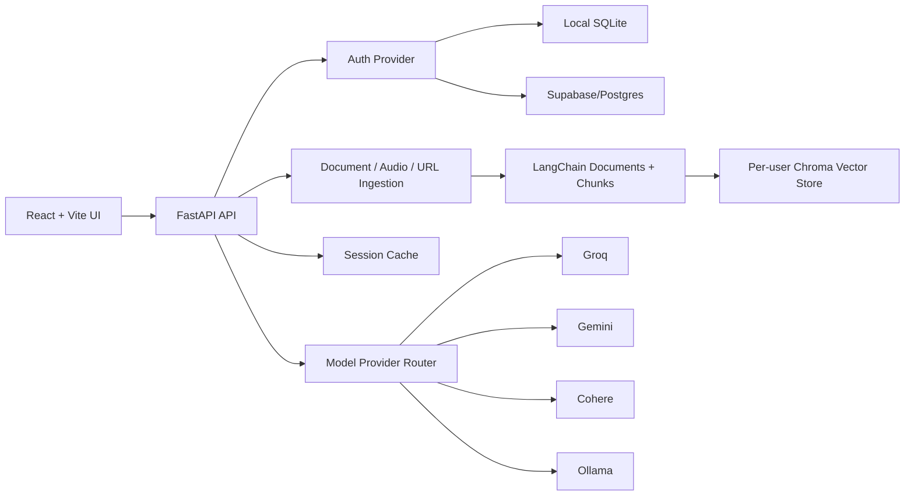

# Ragverse

Cache-based multimodal RAG assistant built with FastAPI, LangChain, Chroma, FlashRank reranking, React, and Vite.

Ragverse lets authenticated users upload documents, audio clips, and web URLs, then ask questions over the active knowledge sources. The app supports local-first development with SQLite auth and a production-ready Supabase/Postgres metadata model for deployed environments.

## Features

- Document RAG for PDF, DOCX, XLSX, CSV, and PPTX files.
- Audio RAG for MP3, WAV, M4A, OGG, WEBM, and MP4 audio/video containers.
- URL ingestion with readable-content extraction.
- Per-user Chroma collections and per-user upload directories.
- Cache-aware retrieval flow for active documents.
- MMR retrieval with FlashRank reranking.
- Provider routing for Groq, Gemini, Cohere, and Ollama.
- Local SQLite auth for development.
- Supabase/Postgres metadata tables for production.
- Guardrails for corrupted files, fake extensions, private URLs, localhost URLs, oversized sources, and low-content pages.

## Architecture



## Supported Sources

| Source type | Supported inputs | Processing path |
| --- | --- | --- |
| Documents | `.pdf`, `.docx`, `.xlsx`, `.csv`, `.pptx` | LangChain loaders, chunking, optional image extraction |
| Audio | `.mp3`, `.wav`, `.m4a`, `.ogg`, `.webm`, `.mp4` | Groq Whisper transcription, transcript chunking |
| URL | `http` and `https` public pages | SSRF validation, readable text extraction, chunking |

## Local Setup

### Backend

```powershell
cd backend
python -m venv denv
.\denv\Scripts\activate
pip install -r requirements.txt
copy .env.example .env
uvicorn main:app --host 127.0.0.1 --port 8000 --reload
```

Recommended local backend env:

```env
ENV=local
AUTH_PROVIDER=local
STORAGE_MODE=local
SQLITE_DB_PATH=./data/ragverse.db
RAG_CHAT_MODELS=groq:llama-3.3-70b-versatile,gemini:gemini-2.5-flash,ollama:llama3.2
EMBEDDING_MODELS=gemini:gemini-embedding-001,cohere:embed-english-light-v3.0,ollama:nomic-embed-text
TRANSCRIPTION_MODELS=groq:whisper-large-v3-turbo
```

Local auth works without Supabase. SQLite is created automatically at `backend/data/ragverse.db`.

### Frontend

```powershell
cd frontend
npm install
npm run dev
```

The frontend runs at `http://127.0.0.1:5173` and calls the backend at `http://localhost:8000/api` by default.

## Provider Routing

Ragverse uses env-driven provider routes:

```env
RAG_CHAT_MODELS=groq:llama-3.3-70b-versatile,gemini:gemini-2.5-flash,ollama:llama3.2
VISION_MODELS=gemini:gemini-2.5-flash,ollama:qwen3-vl:2b
TRANSCRIPTION_MODELS=groq:whisper-large-v3-turbo
EMBEDDING_MODELS=gemini:gemini-embedding-001,cohere:embed-english-light-v3.0,ollama:nomic-embed-text
```

Local development can use cloud providers first and Ollama as the final fallback. Production can remove Ollama from the route lists and use only hosted providers.

## Production Deployment

The backend includes `render.yaml` for Render deployment.

Production env should include:

```env
ENV=production
AUTH_PROVIDER=supabase
STORAGE_MODE=supabase
DATABASE_URL=<supabase-postgres-url>
SUPABASE_URL=<supabase-project-url>
SUPABASE_KEY=<server-side-key>
SUPABASE_BUCKET=ragverse
JWT_SECRET_KEY=<strong-secret>
GROQ_API_KEY=<key>
GEMINI_API_KEY=<key>
COHERE_API_KEY=<key>
BACKEND_CORS_ORIGINS=<frontend-origin>
```

Use `supabase_schema.sql` to create production tables:

- `users`
- `documents`
- `document_artifacts`
- `document_chunks`

Each document, artifact, and chunk metadata row is mapped to `user_id`. Deletes are scoped by authenticated user and cascade through the metadata tables.

## Security Guardrails

### File Guardrails

- Extension allowlist.
- File size limits.
- Separate audio size limit.
- Empty file rejection.
- Pure-Python file signature validation.
- Fake extension detection.
- Filename sanitization.

### URL Guardrails

- Only `http` and `https`.
- Blocks localhost and `.localhost`.
- Blocks private, loopback, link-local, reserved, multicast, and metadata-service IPs.
- Revalidates redirect targets.
- Limits response size.
- Accepts only HTML/text content.
- Rejects pages without enough readable text.

## Deletion Behavior

Deleting a document removes:

- Chroma chunks for the authenticated user and document.
- Local upload folder.
- Supabase storage artifacts when production storage is enabled.
- Metadata rows in `documents`, `document_artifacts`, and `document_chunks`.
- Active-session/cache references.

## Test Evidence

### Backend Guardrails

Run:

```powershell
cd backend
.\denv\Scripts\python.exe tests\guardrail_check.py
```

Observed checks:

| Case | Expected result | Status |
| --- | --- | --- |
| Valid WAV file | Accepted by upload validation | PASS |
| Corrupted `.wav` bytes | Rejected with MIME/signature mismatch | PASS |
| Empty upload | Rejected with `File is empty` | PASS |
| Unsupported `.exe` extension | Rejected by extension allowlist | PASS |
| WAV bytes renamed to `.pdf` | Rejected as fake extension | PASS |
| `file://` URL | Blocked | PASS |
| `localhost` URL | Blocked | PASS |
| `127.0.0.1` URL | Blocked | PASS |
| `169.254.169.254` metadata URL | Blocked | PASS |
| Unresolvable URL host | Blocked | PASS |
| Thin/low-content HTML | Rejected | PASS |

### Build Checks

| Check | Command | Status |
| --- | --- | --- |
| Backend import | `python -c "import main"` | PASS |
| Local SQLite auth | Register and login through auth service | PASS |
| Frontend build | `npm run build` | PASS |
| Frontend lint | `npm run lint` | PASS |

## Repository Hygiene

Ignored local/generated paths include:

- `.env`
- `backend/data/`
- `backend/uploads/`
- `backend/chroma_db/`
- `frontend/node_modules/`
- `frontend/dist/`
- `test-assets/`

No secrets are required in the frontend. Backend secrets belong in `backend/.env` locally or Render environment variables in production.
